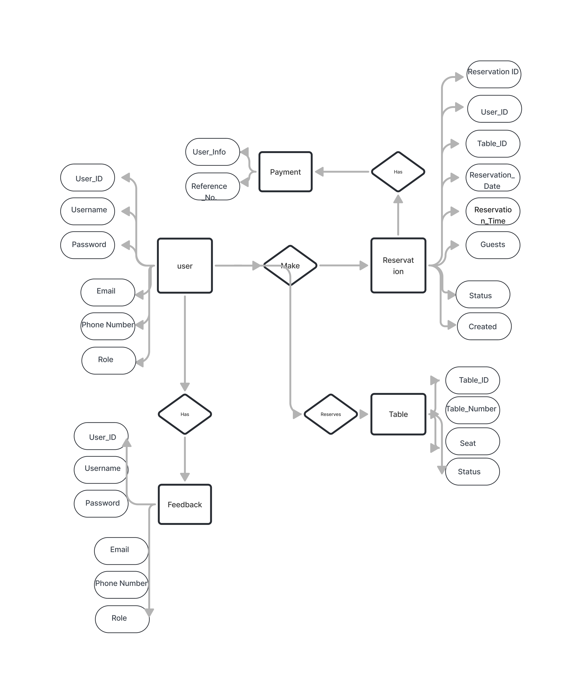

# Restaurant Reservation System 

## INTRODUCTION

 Today, we live in the world where the internet is of absolute importance, as 3 billion people or 45% of the population of the world are using the internet. Due to such rapid developments, the number of people willing to offer their food online services, with the expectation to grow to 60%, has also increased. Getting the Meals people reside in different regions and cities. Nevertheless, there are many restaurants that cannot find enough customers mainly because of lack of marketing and unnecessary indifference to their establishments.

 In order to solve this problem we propose to design an innovative online resource which will make life easier for users and allow them to find available tables at restaurants and see their menus and other offers. This system will be internet based and available on the smartphones, computers and any personal devices that can access the internet. The project aims to cater many people in the Philippines.

 In a word, the Internet has already become an integral part of people's lives and this is the reason why about 3 billions people worldwide watch it. With such rapid growth, more people have started looking for dining places, with numerous individuals nowadays making prior reservations to avoid disappointment.

## Project Features and Characteristics

## 1. Reservation Module

• Booking: Customers select a date, time, and count of people to make a table 
 reservation.

• Calendar: Shows which times are available or already booked.

• Confirmation: Sends a message to confirm the reservation.

• Customer Records: Keeps track of past reservations.

## 2. Table 

• Table Map: Shows where tables are in the restaurant.

• Assigning Tables: Puts customers at tables based on their booking.

• Live Updates: Shows if tables are free, reserved, or in use.

## 3. User Module

• Customer Info: Saves customer details like name and preferences.

• Staff Roles: Handles different permissions for admins, hosts, and waiters.

• Contact: Lets staff send messages to customers.

## 4. Reports Module

• Booking Reports: Shows daily, weekly, and monthly booking details.

• Table Use: Tracks which tables are used most often.

## 5. Feedback Module

• Feedback: Asks customers how their dining experience was.

• Ratings: Let customers rate their experience.

• Responses: Allows staff to reply to feedback.

## Project Scope

The purpose of the restaurant reservation system is to make easier and organized 
the process for reserving tables, managing these bookings, and handling interactions with 
customers. 
The system will enable customers to book their desired tables through system, see 
real-time availability of seats, and get confirmation details via email/sms. 
It also includes functions for managing tables which helps in assigning them quickly 
by restaurant workers as well as keeps track on status all day long. 
The system will handle user management, giving the right to customers and staff 
to make profiles and enter the system based on their roles. 
The system also provides reports about reservations, table use rates, as well as feedback 
from customers. 
These details offer important information for managing a restaurant effectively. 
Regarding the payment section, it will help streamline online transactions; 
at the same time, the notification area ensures that all reminders and updates related 
to customer bookings are sent out promptly. 
Lastly, the feedback module will collect and manage customer reviews, 
supporting the restaurant in continuously improving its services.

## Limitations

Though the restaurant reservation system intends to include necessary functions, there 
are a few restrictions. The main concentration is on dealing with table reservations and it might
not seamlessly blend in with other systems for restaurant management like inventory or staff 
scheduling because of its limited scope. For real-time updates and notifications, you require a 
constant internet connection that could impact performance if the connectivity is weak or 
unstable. The user management module will have basic role assignments, but it may not 
support more complex permissions. The system can process online payments, but it might lack 
advanced financial reporting. Lastly, while the system will generate standard reports, custom 
report generation might be limited.

## Work breakdown Structure

## Functional Requirements

### User Requirements

| **No.** | **Users**   | **System Features**         | **Requirement**                                                                                                           |
|---------|-------------|-----------------------------|---------------------------------------------------------------------------------------------------------------------------|
| 1       | Customer    | A. User Registration        | 1. The system must allow users to create an account by entering:                                                            |
|         |             |                             |    a. Name                                                                                                                |
|         |             |                             |    b. Email                                                                                                               |
|         |             |                             |    c. Password                                                                                                           |
| 2       | Customer    | B. User Login               | 2. The system must allow users to log in by entering:                                                                      |
|         |             |                             |    a. Email                                                                                                               |
|         |             |                             |    b. Password                                                                                                           |
| 3       | Customer    | C. View Available Tables    | 3. The system must display available tables based on:                                                                     |
|         |             |                             |    a. Selected date                                                                                                       |
|         |             |                             |    b. Selected time                                                                                                       |
| 4       | Customer    | D. Make a Reservation       | 4. The system must allow users to make a reservation by entering:                                                           |
|         |             |                             |    a. Table selection                                                                                                     |
|         |             |                             |    b. Date                                                                                                               |
|         |             |                             |    c. Time                                                                                                               |
|         |             |                             |    d. Number of guests                                                                                                    |
| 5       | Customer    | E. Modify Reservation       | 5. The system must allow users to modify a reservation by entering:                                                         |
|         |             |                             |    a. New date                                                                                                           |
|         |             |                             |    b. New time                                                                                                           |
|         |             |                             |    c. Updated number of guests                                                                                            |
| 6       | Customer    | F. Cancel Reservation       | 6. The system must allow users to cancel their reservation.                                                                |
| 7       | Customer    | G. Receive Confirmation     | 7. The system must send a confirmation via:                                                                              |
|         |             |                             |    a. Email                                                                                                               |
|         |             |                             |    b. SMS                                                                                                                 |
| 8       | Customer    | H. Payment Process          | 8. The system must allow users to pay using:                                                                             |
|         |             |                             |    a. QR code                                                                                                            |
| 9       | Admin       | A. Admin Login              | 9. The system must allow admins to log in using:                                                                          |
|         |             |                             |    a. Admin credentials                                                                                                   |
| 10      | Admin       | B. Manage Reservations      | 10. The system must allow admins to:                                                                                     |
|         |             |                             |    a. View reservations                                                                                                  |
|         |             |                             |    b. Modify reservations                                                                                               |
|         |             |                             |    c. Cancel reservations                                                                                               |
| 11      | Admin       | C. View Reports             | 11. The system must allow admins to generate and view:                                                                    |
|         |             |                             |    a. Daily reports                                                                                                     |
|         |             |                             |    b. Weekly reports                                                                                                    |
|         |             |                             |    c. Monthly reports                                                                                                   |
|         |             |                             |    d. Semestral reports                                                                                                 |
| 12      | Admin       | D. Manage Tables            | 12. The system must allow admins to manage:                                                                             |
|         |             |                             |    a. Table details                                                                                                     |

### use case

## Database Architecture

### Data Dictionary**

---

#### **Table 1: USER**

| **FIELD NAME** | **DESCRIPTION**                             | **DATA TYPE** | **LENGTH** | **SAMPLE**             |
|----------------|---------------------------------------------|---------------|------------|------------------------|
| USER_ID        | Unique identification of the user           | String        | 255        | USER123456             |
| USERNAME       | Username for login                          | String        | 255        | janedoe                |
| PASSWORD       | User's password (hashed)                    | String        | 255        | ******                 |
| EMAIL          | User's email address                        | String        | 255        | janedoe@example.com    |
| PHONE_NUMBER   | User's contact number                       | String        | 20         | 09123456789            |
| ROLE           | Role of the user                            | String        | 50         | Customer / Staff       |

---

#### **Table 2: RESERVATION**

| **FIELD NAME**        | **DESCRIPTION**                             | **DATA TYPE** | **LENGTH** | **SAMPLE**             |
|-----------------------|---------------------------------------------|---------------|------------|------------------------|
| RESERVATION_ID        | Unique identification of the reservation    | String        | 255        | Reserve12345           |
| USER_ID               | ID of the customer making the reservation   | String        | 255        | USER123456             |
| TABLE_ID              | ID of the reserved table                    | String        | 255        | TABLE002               |
| STATUS                | Status of the reservation                   | String        | 50         | Confirmed / Cancelled  |
| RESERVATION_DATE      | Date of the reservation                     | Date          |            | 2024-08-21             |
| RESERVATION_TIME      | Time of the reservation                     | Time          |            | 6:00 pm                |
| GUESTS                | Number of guests                            | Integer       |            | 4                      |
| CREATED               | Date timestamp of reservation creation      | Date          |            | 2024-08-21 - 2:25 pm   |

---

#### **Table 3: TABLE**

| **FIELD NAME** | **DESCRIPTION**                        | **DATA TYPE** | **LENGTH** | **SAMPLE** |
|----------------|----------------------------------------|---------------|------------|------------|
| TABLE_ID       | Unique identification of the table     | String        | 255        | TABLE002   |
| TABLE_NUMBER   | Table number in the restaurant         | String        | 50         | 12         |
| STATUS         | Status of the table                    | String        | 50         | Available / Reserved |
| SEATS          | Number of seats at the table           | Integer       |            | 4          |

---
#### **Table 4: PAYMENT**

| **FIELD NAME** | **DESCRIPTION**                                                 | **DATA TYPE** | **LENGTH** | **SAMPLE** |
|----------------|-----------------------------------------------------------------|---------------|------------|------------|
| USER_INFO      | Unique identification of the table                              | String   | 255     | TABLE002   |
| REFERENE_N0.   | unique alphanumeric code assigned to each transaction in GCash.|Interger | 255       | 123456789  |

---
#### **Table 5: FEEDBACK**

| **FIELD NAME**   | **DESCRIPTION**                                | **DATA TYPE** | **LENGTH** | **SAMPLE**             |
|------------------|----------------------------------------------|---------------|------------|------------------------|
| FEEDBACK_ID      | Unique identification of the feedback       | String        | 255        | Feedback123456         |
| USER_ID          | ID of the customer giving feedback           | String        | 255        | USER123456             |
| RESERVATION_ID   | ID of the related reservation                | String        | 255        | Reserve789123          |
| RATING           | Customer's rating                            | Integer       |            | 5                      |
| COMMENTS         | Customer's comments                          | String        | 500        | Excellent service!     |
| CREATED          | Date timestamp of feedback submission        | Date          |            | 2024-08-21 – 3:00 pm   |

---

## ERD

For Best View
[https://www.canva.com/design/DAGOpYLp1fs/5ACVfuyI1XscCkCIyhPCZw/edit?utm_content=DAGOpYLp1fs&utm_campaign=designshare&utm_medium=link2&utm_source=sharebutton](https://www.figma.com/board/s2n0rJsW0DadPWtlJFZk2Q/ERD?t=Zdc5cbdIlPAcc5YZ-6)

## Non Functional Requirements

### Product Requirement (PLEASE SKIP THIS)

### Organizational Requirement (PLEASE SKIP THIS)

### External Requirements  (PLEASE SKIP THIS)

## System Testing and Evaluation   (PLEASE SKIP THIS)

### Functional Testing Procedure   (PLEASE SKIP THIS)

### Functional Testing Summary

### Evaluation Procedure

### Recommendation

### Wireframe (PLEASE SKIP THIS)

### High Fidelity (PLEASE SKIP THIS)

### System Screenshot (PLEASE SKIP THIS)
